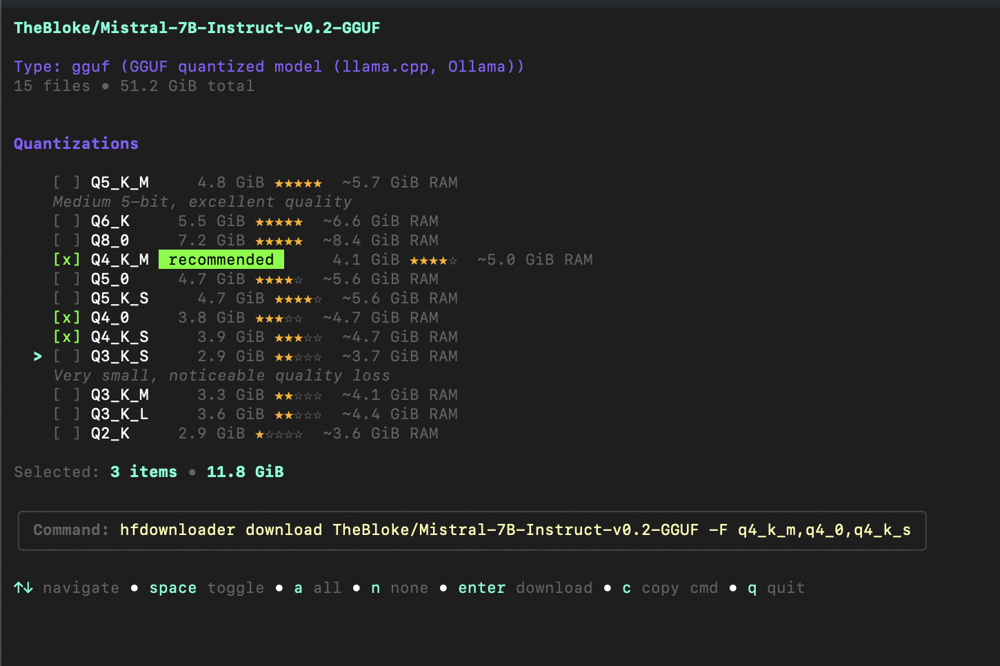
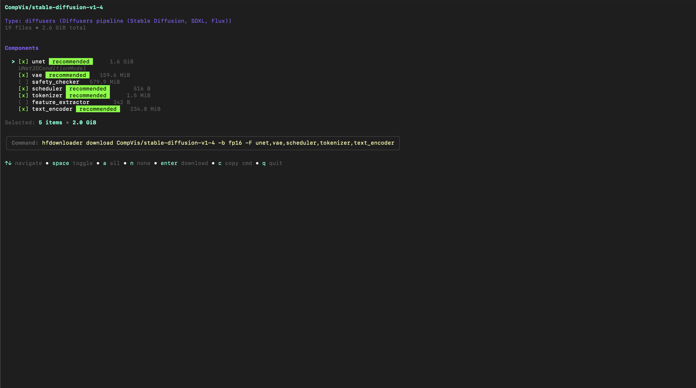
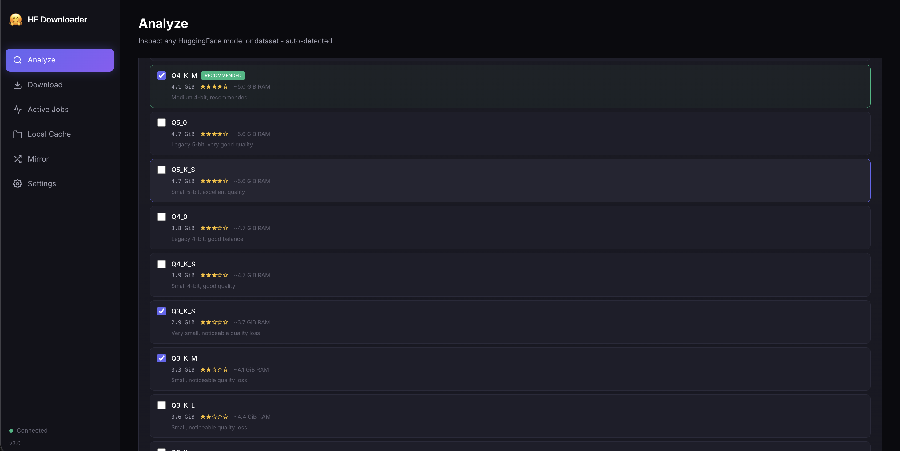
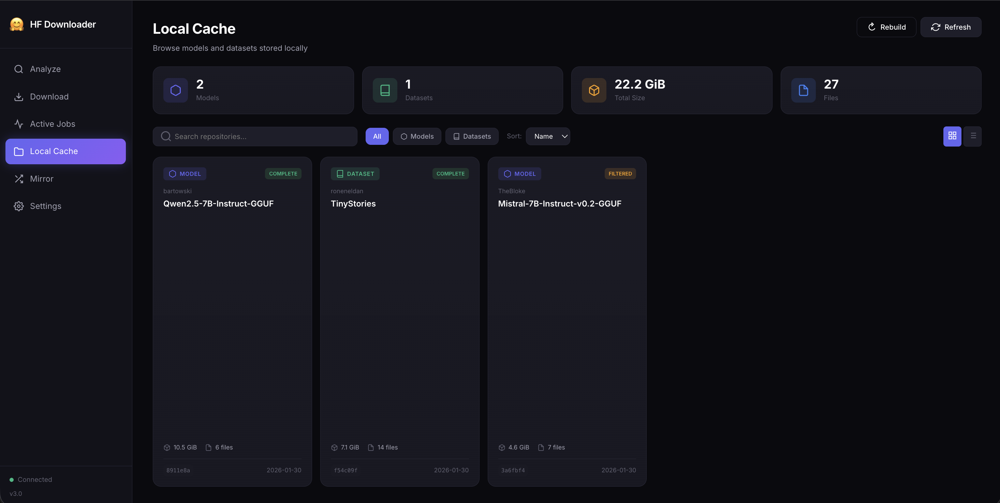
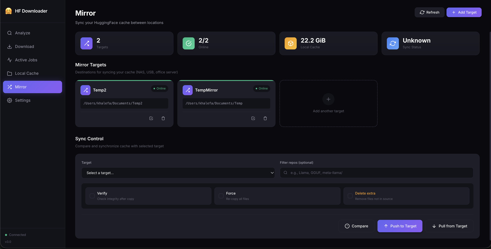

<div align="center">

# HuggingFace Downloader

**The fastest, smartest way to download models from HuggingFace Hub**

[](https://go.dev)
[](LICENSE)
[](https://github.com/bodaay/HuggingFaceModelDownloader/releases)
[](https://github.com/bodaay/HuggingFaceModelDownloader/releases)
[](https://github.com/bodaay/HuggingFaceModelDownloader/actions/workflows/release.yml)
[](https://github.com/bodaay/HuggingFaceModelDownloader/actions/workflows/docker-publish.yml)

**Parallel downloads** • **Smart GGUF analyzer** • **Python compatible** • **Full proxy support**

[Quick Start](#quick-start) •
[Why This Tool](#why-this-tool) •
[Smart Analyzer](#smart-analyzer) •
[Web UI](#web-ui) •
[Mirror Sync](#mirror-sync) •
[Proxy Support](#proxy-support)

</div>

---

## Why This Tool?

### Parallel Downloads

Maximize your bandwidth with **multiple connections per file** and **concurrent file downloads**:

- Up to 16 parallel connections per file (chunked download)
- Up to 8 files downloading simultaneously
- Automatic resume on interruption


Real-time progress with per-file status, speed, and ETA.

### Interactive GGUF Picker

Don't guess which quantization to download. Use `-i` for an **interactive picker** with quality ratings and RAM estimates:

```bash
hfdownloader analyze -i TheBloke/Mistral-7B-Instruct-v0.2-GGUF
```



**Interactive mode features:**
- **Keyboard navigation** - Use ↑↓ to browse, space to toggle selection
- **Quality ratings** - Stars (★★★★☆) show relative quality
- **RAM estimates** - Know if it'll fit in your VRAM
- **"Recommended" badge** - We highlight the best balance (Q4_K_M)
- **Live totals** - See combined size as you select
- **One-click download** - Press Enter to start, or `c` to copy command

**Without `-i`**, output is text/JSON — perfect for scripts and piping to other tools.

### Python Just Works

Downloads go to the standard HuggingFace cache. Python libraries find them automatically:

```python
from transformers import AutoModel
model = AutoModel.from_pretrained("TheBloke/Mistral-7B-GGUF")  # Just works
```

Plus, you get **human-readable paths** at `~/.cache/huggingface/models/` for easy browsing.

### Works Behind Corporate Firewalls

Full proxy support including **SOCKS5**, **authentication**, and **CIDR bypass rules**:

```bash
hfdownloader download meta-llama/Llama-2-7b --proxy socks5://localhost:1080
```

---

## Quick Start

**Try it first — no installation required:**

```bash
# Analyze a model with interactive GGUF picker
bash <(curl -sSL https://g.bodaay.io/hfd) analyze -i TheBloke/Mistral-7B-GGUF

# Download a model
bash <(curl -sSL https://g.bodaay.io/hfd) download TheBloke/Mistral-7B-GGUF

# Start web UI
bash <(curl -sSL https://g.bodaay.io/hfd) serve

# Start web UI with authentication
bash <(curl -sSL https://g.bodaay.io/hfd) serve --auth-user admin --auth-pass secret
```

**Like it? Install permanently:**

```bash
bash <(curl -sSL https://g.bodaay.io/hfd) install
```

Now use directly:

```bash
hfdownloader analyze -i TheBloke/Mistral-7B-GGUF
hfdownloader download TheBloke/Mistral-7B-GGUF:q4_k_m
hfdownloader serve
hfdownloader serve --auth-user admin --auth-pass secret   # with authentication
```

Files go to `~/.cache/huggingface/` — Python libraries find them automatically.

---

## Smart Analyzer

Not sure what's in a repository? Analyze it first:

```bash
hfdownloader analyze <any-repo>
```

For **GGUF models**, you get an interactive picker (see screenshot above). For other types, the analyzer **auto-detects** and shows relevant information:

| Type | What It Shows |
|------|---------------|
| **GGUF** | Interactive picker with quality ratings, RAM estimates, multi-select |
| **Transformers** | Architecture, parameters, context length, vocabulary size |
| **Diffusers** | Pipeline type, components, variants (fp16, bf16) |
| **LoRA** | Base model, rank, alpha, target modules |
| **GPTQ/AWQ** | Bits, group size, estimated VRAM |
| **Dataset** | Formats, configs, splits, sizes |

### Multi-Branch Support

Some repos have multiple branches (fp16, onnx, flax). The analyzer lets you pick:

```bash
hfdownloader analyze -i CompVis/stable-diffusion-v1-4
```


### Diffusers Component Picker

For Stable Diffusion models, pick exactly which components you need:



Select `unet`, `vae`, `text_encoder` — skip what you don't need. The command is generated automatically.

---

## Download Features

### Inline Filter Syntax

Download specific files without extra flags:

```bash
# Download only Q4_K_M quantization
hfdownloader download TheBloke/Mistral-7B-GGUF:q4_k_m

# Download multiple quantizations
hfdownloader download TheBloke/Mistral-7B-GGUF:q4_k_m,q5_k_m

# Or use flags
hfdownloader download TheBloke/Mistral-7B-GGUF -F q4_k_m -E ".md,fp16"
```

### Resume & Verify

```bash
# Interrupted? Just run again - automatically resumes
hfdownloader download owner/repo

# Strict verification
hfdownloader download owner/repo --verify sha256

# Preview what would download
hfdownloader download owner/repo --dry-run
```

### High-Speed Mode

```bash
# Maximum parallelism
hfdownloader download owner/repo -c 16 --max-active 8
```

| Flag | Default | Description |
|------|---------|-------------|
| `-c, --connections` | 8 | Connections per file |
| `--max-active` | 3 | Concurrent file downloads |
| `-F, --filters` | | Include patterns |
| `-E, --exclude` | | Exclude patterns |
| `-b, --revision` | main | Branch, tag, or commit |

---

## Dual-Layer Storage

We maintain **two views** of your downloads:

```
~/.cache/huggingface/
├── hub/                              # Layer 1: HF Cache (Python compatible)
│   └── models--TheBloke--Mistral.../
│       └── snapshots/a1b2c3d4.../
│           └── model.gguf
│
└── models/                           # Layer 2: Human-Readable
    └── TheBloke/
        └── Mistral-7B-GGUF/
            ├── model.gguf            → symlink to hub/...
            └── hfd.yaml              # Download manifest
```

**Layer 1 (hub/)**: Standard HuggingFace cache structure. Python libraries work automatically.

**Layer 2 (models/)**: Human-readable paths with symlinks. Browse your downloads like normal folders.

### Manifest Tracking

Every download creates `hfd.yaml` so you know exactly what you have:

```yaml
repo: TheBloke/Mistral-7B-GGUF
branch: main
commit: a1b2c3d4...
downloaded_at: 2024-01-15T10:30:00Z
command: hfdownloader download TheBloke/Mistral-7B-GGUF -F q4_k_m
files:
  - path: mistral-7b.Q4_K_M.gguf
    size: 4368438272
```

```bash
# List everything you've downloaded
hfdownloader list

# Get details about a specific download
hfdownloader info Mistral
```

---

## Web UI

A modern web interface with real-time progress:

```bash
hfdownloader serve
# Open http://localhost:8080
```



### Cache Browser

Browse everything you've downloaded with stats, search, and filters:



### Mirror Sync UI

Configure targets and sync your cache between locations:



### All Pages

| Page | Features |
|------|----------|
| **Analyze** | Enter any repo, auto-detect type, see files/sizes, pick GGUF quantizations |
| **Jobs** | Real-time WebSocket progress, pause/resume/cancel, download history |
| **Cache** | Browse downloaded repos, disk usage stats, search & filter |
| **Mirror** | Configure targets, compare differences, push/pull sync |
| **Settings** | Token, connections, proxy, verification mode |

### Server Options

```bash
hfdownloader serve \
  --port 3000 \
  --auth-user admin \
  --auth-pass secret \
  -t hf_xxxxx
```

---

## Mirror Sync

Sync your model cache between machines — home, office, NAS, USB drive.


```bash
# Add mirror targets
hfdownloader mirror target add office /mnt/nas/hf-models
hfdownloader mirror target add usb /media/usb/hf-cache

# Compare local vs target
hfdownloader mirror diff office

# Push local cache to target
hfdownloader mirror push office

# Pull from target to local
hfdownloader mirror pull office

# Sync specific repos only
hfdownloader mirror push office --filter "Llama,GGUF"

# Verify integrity after sync
hfdownloader mirror push office --verify
```

Perfect for:
- **Air-gapped environments**: Download at home, sync to office
- **Team sharing**: Central NAS with all models
- **Backup**: Keep a copy on external drive

---

## Proxy Support

Full proxy support for corporate environments:

```bash
# HTTP proxy
hfdownloader download owner/repo --proxy http://proxy:8080

# SOCKS5 (e.g., SSH tunnel)
hfdownloader download owner/repo --proxy socks5://localhost:1080

# With authentication
hfdownloader download owner/repo \
  --proxy http://proxy:8080 \
  --proxy-user myuser \
  --proxy-pass mypassword

# Test proxy connectivity before downloading
hfdownloader proxy test --proxy http://proxy:8080
```

### Supported Types

| Type | URL Format |
|------|------------|
| HTTP | `http://host:port` |
| HTTPS | `https://host:port` |
| SOCKS5 | `socks5://host:port` |
| SOCKS5h | `socks5h://host:port` (remote DNS) |

### Configuration File

Save proxy settings in `~/.config/hfdownloader.yaml`:

```yaml
proxy:
  url: http://proxy.corp.com:8080
  username: myuser
  password: mypassword
  no_proxy: localhost,.internal.com,10.0.0.0/8
```

---

## Installation

### One-Liner (Recommended)

```bash
bash <(curl -sSL https://g.bodaay.io/hfd) install
```

That's it. Works on Linux, macOS, and WSL.

**Or run without installing:**

```bash
bash <(curl -sSL https://g.bodaay.io/hfd) download TheBloke/Mistral-7B-GGUF
bash <(curl -sSL https://g.bodaay.io/hfd) serve   # Web UI
```

### Download Binary

Get from [Releases](https://github.com/bodaay/HuggingFaceModelDownloader/releases):

| Platform | Architecture | File |
|----------|--------------|------|
| Linux | x86_64 | `hfdownloader_linux_amd64_*` |
| Linux | ARM64 | `hfdownloader_linux_arm64_*` |
| macOS | Apple Silicon | `hfdownloader_darwin_arm64_*` |
| macOS | Intel | `hfdownloader_darwin_amd64_*` |
| Windows | x86_64 | `hfdownloader_windows_amd64_*.exe` |

### Build from Source

```bash
git clone https://github.com/bodaay/HuggingFaceModelDownloader
cd HuggingFaceModelDownloader
go build -o hfdownloader ./cmd/hfdownloader
```

### Docker

```bash
# Pull from GitHub Container Registry
docker pull ghcr.io/bodaay/huggingfacemodeldownloader:latest

# Or build locally
docker build -t hfdownloader .

# Run (mounts your local HF cache)
docker run --rm -v ~/.cache/huggingface:/home/hfdownloader/.cache/huggingface \
  ghcr.io/bodaay/huggingfacemodeldownloader download TheBloke/Mistral-7B-GGUF
```

---

## Private & Gated Models

For private repos or gated models (Llama, etc.):

```bash
# Set token via environment
export HF_TOKEN=hf_xxxxx
hfdownloader download meta-llama/Llama-2-7b

# Or via flag
hfdownloader download meta-llama/Llama-2-7b -t hf_xxxxx
```

For gated models, you must first accept the license on the model's HuggingFace page.

---

## China Mirror

Use the HuggingFace mirror for faster downloads in China:

```bash
hfdownloader download owner/repo --endpoint https://hf-mirror.com
```

Or set in config file:

```yaml
endpoint: https://hf-mirror.com
```

---

## CLI Reference

| Command | Description |
|---------|-------------|
| `download` | Download models or datasets (default command) |
| `analyze` | Analyze repository before downloading |
| `serve` | Start web server with REST API |
| `list` | List all downloaded repos |
| `info` | Show details about a downloaded repo |
| `rebuild` | Regenerate friendly view from HF cache |
| `mirror` | Sync cache between locations |
| `proxy` | Test and show proxy configuration |
| `config` | Manage configuration |
| `version` | Show version info |

Full documentation: [docs/CLI.md](docs/CLI.md) • [docs/API.md](docs/API.md) • [docs/V3_FEATURES.md](docs/V3_FEATURES.md)

---

## What's New in v3.0

| Feature | Description |
|---------|-------------|
| **HF Cache Compatibility** | Downloads now use standard HuggingFace cache structure |
| **Dual-Layer Storage** | Python-compatible cache + human-readable symlinks |
| **Smart Analyzer** | Auto-detect model types, GGUF quality ratings, RAM estimates |
| **Web UI v3** | Modern interface with real-time WebSocket progress |
| **Mirror Sync** | Push/pull cache between locations |
| **Full Proxy Support** | HTTP, SOCKS5, authentication, CIDR bypass |
| **Manifest Tracking** | `hfd.yaml` records what/when/how for every download |

### Upgrading from v2.x

v3.0 uses HF cache by default. For v2.x behavior:

```bash
hfdownloader download owner/repo --legacy -o ./my-models
```

---

## Environment Variables

| Variable | Purpose |
|----------|---------|
| `HF_TOKEN` | HuggingFace access token |
| `HF_HOME` | Override `~/.cache/huggingface` |
| `HTTP_PROXY` | Proxy for HTTP requests |
| `HTTPS_PROXY` | Proxy for HTTPS requests |
| `NO_PROXY` | Comma-separated bypass list |

---

## License

[Apache 2.0](LICENSE) — use freely in personal and commercial projects.

---

<div align="center">

**[Full CLI Docs](docs/CLI.md)** • **[REST API](docs/API.md)** • **[V3 Features](docs/V3_FEATURES.md)** • **[Issues](https://github.com/bodaay/HuggingFaceModelDownloader/issues)**

</div>
